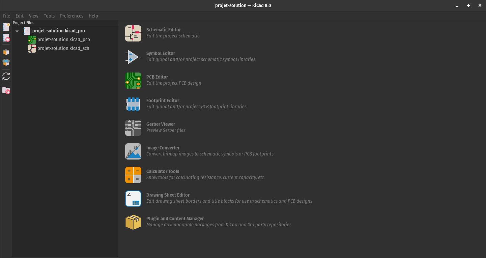

# Le projet
Comme mentionné plus tôt, le produit final de cette formation sera un petit PCB avec une puce
permettant de mesurer l'état d'une de nos batteries. Les requis sont les suivants:
> Nous avons besoin d'un circuit permettant de mesurer la tension et le courant d'une batterie,
> ainsi que de compter le nombre de coulombs qui en sortent pour avoir une estimation de l'énergie
> restante. De plus, il doit être possible de le connecter à notre ordinateur de bord à l'aide d'un
> protocole parmi I2C, Serial ou UART. Les batteries mesurées auront un potentiel de 25.6V à leurs
> bornes et notre charge (*load*) demandera jusqu'à 8A.

# Liste des pièces et recueil des datasheet
La première étape et potentiellement la plus importante est de définir les composants nécessaires
au circuit.

La première pièce à trouver est donc une puce permettant de mesurer les valeurs demandées. Après un
peu de recherche en ligne, nous somme tombés sur la puce LTC2944 de Analog Devices. Cette puce
utilise le protocole I2C qui est compatible avec notre ordinateur de bord. Son datasheet se trouve
[ici](https://polymtlca0.sharepoint.com/:b:/r/sites/Exocet/Shared%20Documents/General/EMBARQU%C3%89%20+%20%C3%89LECTRIQUE/DATASHEETS/PCB%20Components/Battery%20Gauge%20-%20LTC2944/2944fa.pdf?csf=1&web=1&e=CUk02e).
**Exercice**: essayez de le trouver par vous-même en cherchant en ligne.

Le datasheet inclut un exemple d'application typique utilisant la puce. Ce dernier nous donne de
bonnes indications quant aux composantes à inclure dans notre circuit. Ainsi, il sera nécessaire
d'avoir 3 résistances de $2kΩ$ pour les fils de communication I2C. De plus, il nous faut une
résistance $R_{sense}$. Cette dernière est une résistance spéciale de type *shunt* qui cause une
très faible baisse de tension. La page 11 du datasheet nous indique comment calculer la valeur de
cette résistance:

$$
R_{sense} \leq \frac{50mV}{I_{max}} = \frac{50mV}{8A} = 6.25mΩ
$$

Ainsi, nous allons utiliser une résistance de $5mΩ$.

Finalement, il sera nécessaire d'avoir 2 connecteurs au abords du PCBs. Le premier sera connecté au
terminal positif de la batterie ainsi qu'à notre charge (*load*). Ses terminaux seront connectés à
ceux de $R_{sense}$. De plus, nous auront besoin d'un connecteur à 5 fiches (*pins*) pour le bus de
données I2C, pour le GND, ainsi que l'entrée de puissance de +3.3V pour le circuit. Nous utiliserons
un *screw terminal* pour le premier et un connecteur *JST PH* pour le second.

Pour simplifier, nous ne chercherons pas le datasheet des connecteurs ou des résistances, même si il
serait important de le faire pour vérifier qu'ils peuvent supporter le courant et la tension
demandés.

# Création du projet KiCad
Pour commencer, assurez vous d'avoir fait un `clone` local de ce dépôt git et d'être sur une
nouvelle branche. Pour ce faire, vous pouvez entrer les commandes suivantes dans le dossier où vous
voulez enregistrer le projet:
```bash
$ git clone https://github.com/Exocet-Polytechnique/formation-pcbs.git
$ git checkout -b <nom>
$ git push --set-upstream origin <nom>
```
Où vous devez remplacer `<nom>` par votre nom en minuscules.

Nous pouvons maintenant passer à la création du projet KiCad qui nous sera utile pour toutes les
autres parties de la formation. À l'ouverture de KiCad, on arrive sur une fenêtre similaire à
celle-ci (sans fichiers dans la section à gauche):


Pour créer un projet, il suffit d'aller dans `File > New Project` (ou d'appuyer sur `Ctrl-N`). Par
défaut, KiCad créera un fichier pour le pcb (`.kicad_pcb`) et un autre pour le schéma
(`.kicad_sch`).

Nous n'installerons pas de librarie globale pour le projet, mais il serait possible de le faire en
allant dans `Preferences > Manage Symbol Libraries`. Nous reviendrons sur ce point quand il sera
nécessaire. Pour faire court, les librairies sont englobent des dossiers composés de composantes standard 
et de composantes spécifiques aux projets. 

