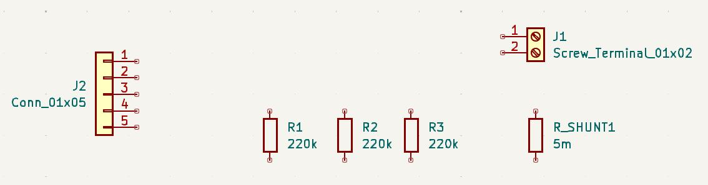
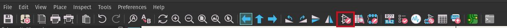

*N'oubliez pas de sauvegarder votre travail à des intervalles réguliers!*

# Ajout des pièces au schéma
La première étape pour créer les schéma est d'y ajouter les pièces et composants. Pour ce faire, on
peut appuyer sur la touche `A` du clavier. Il y aura un plus long chargement la première fois, mais
vous verrez ensuite une très longue liste de pièces que vous pouvez ajouter. Vous pouvez chercher
pour les pièces nécessaire dans la barre de recherche.

Commençons par placer une première résistance (cherchez `R`). Une fois la pièce placée, vous pouvez
faire un double-clic dessus pour ouvrir ses propriétés. Dans la rangée `Value` changez `R` pour
`220k`. Appuyez sur `Ctrl+Enter` pour fermer la boîte de dialogue. Vous pouvez ensuite duplique
cette résistance avec `Ctrl+D` deux fois, afin d'avoir 3 résistances de $220kΩ$ comme indiqué dans
l'example d'application du LTC2944. Nous pouvons maintenant ajouter la résistance *shunt*. Bien
qu'il existe des symboles pour ce type de résistance, nous utiliserons une résistance régulière pour
la représenter. Vous pouvez donc ajouter une autre résistance et changer sa valeur pour `5m`.
Changez aussi la valeur de la référence à `R_SHUNT1` pour bien la repérer par la suite.

Ensuite, nous pouvons ajouter nos deux connecteurs. Il existe plusieurs *screw terminals* dans la
liste de symboles par défaut. Dans notre cas, nous utiliserons selui avec deux terminaux, soit le
`Scew_Terminal_01x02`. Ensuite, il n'existe pas de symbole pour le connecteur *JST PH*, il faudra
donc le substituer par un connecteur générique `Conn_01x05` dans la section des connecteurs
génériques. Nous verrons plus tard où indiquer à KiCad le type de connecteur que nous voulons. Pour
simplifier les connexions par la suite, je vous conseille aussi de retourner ce dernier connecteur
horizontalement en appuyant sur `X`.

Votre schéma actuel devrait ressembler à ceci:

Finalement, nous avons un problème lorsque nous voulons ajouter la puce LTC2944 au schéma: elle
n'est pas disponible dans la libairie par défaut de KiCad. Il faut donc créer notre propre symbole.

# Créer le symbole pour le LTC2944
Pour ouvrir l'éditeur de symboles, il faut cliquer sur le bouton dans le menu horizontal de KiCad ou
retourner au gestionnaire de projet.

Une fois dans l'éditeur de symbole, il faudra créer un librairie locale au projet en allant dans
`File > New Library`, puis en sélectionnant `Projet`. Vous pouvez la nommer `Battery_Gauge`. Vous
pouvez ensuite créer votre symbole en appuyant sur `Ctrl-N`. Appelez-le `LTC2944`, mais laissez les
autres paramètres par défaut.

Pour commencer, nous allons définir les connexions extérieures du module.

# Connecter les composants

# Ajouter les *mounting holes*

# Indiquer à KiCad nos entrées de puissance

# Remplir la cartouche
Pour les futurs PCBs, nous auront notre propre format de cartouche.
