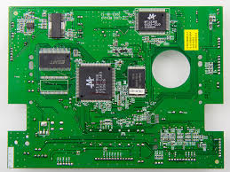
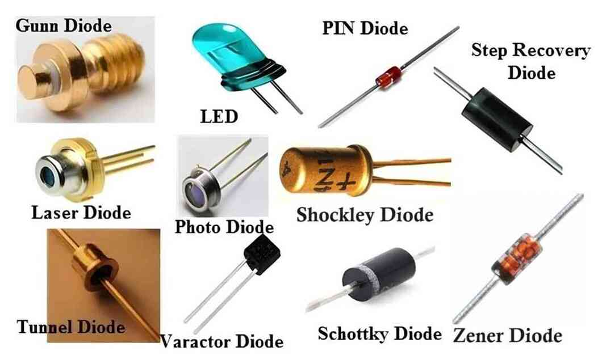
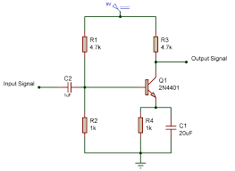

# 1. Vocabulaire général
## KiCad
*KiCad* est un ensemble de logiciels permettant la conceptions de circuits imprimés (*EDA* en
anglais). Il se compose principalement d'un logiciel de création de schémas, d'un autre pour
produire un circuit imprimé basé sur le schéma créé. Il offre aussi quelques outils pour créer des
symboles et générer des traces. KiCad permet donc bien sûr de connecter ces différents modules
entre-eux dans des projet.

Une autre alternative à KiCad fréquemment utilisée en industrie et *Altium*. Les concepts demeurent
les mêmes à travers ces logiciels donc il vous sera facile de le prendre en main par la suite!

## *EDA* - *Electronic Design Automation*
La conception et la fabrication de PCBs ce déroule en plusieurs étapes interreliées. Ainsi, le
processus commence par analyser les requis et déterminer les pièces utilisées ainsi que la manière
dont elles sont reliées. Dans certains cas, il faut aussi définir nos propres pièces en se basant
sur leur datasheet. Ensuite, il faut importer ces pièces pour les placer sur le circuit imprimé,
ainsi que définir les traces nécessaires pour les connecter. De plus, il faut déterminer
l'emplacement des plaques de cuivre pour souder ces dernières à notre circuit imprimé. La dernière
étape pour la production consiste à exporter les différentes couches du PCB en fichiers d'assemblage
afin de les envoyer à une compagnie qui pourra imprimer et assembler nos PCBs.

Un *EDA* est un logiciel qui regroupe toutes les fonctionnalités mentionnées. C'est l'équivalents de
logiciels de CAD (*Computer-Aided Design*) pour les ingénieurs en mécanique. Certains *EDA*
permettent même la conception des circuits à l'intérieur même des circutis intégrés.

## Circuit imprimé (*PCB* - *Printed Circuit Board*)
Un circuit imprimé est une manière compacte de relier plusieurs composants électroniques entre-eux.

Le PCB en lui même est composé d'une alternance de couches d'un conducteur (généralement du cuivre)
et d'un isolant. L'une des étapes de fabrication de ces derniers consiste à enlever le la matière
conductrice pour isoler des traces. Les traces représentent des "fils" qui permettent de connecter
les différentes puces ou composants présents sur le PCB.

## Datasheet
Les datasheet sont parfois intimidants, mais restent la meilleure manière de savoir comment utiliser
une puce électronique. Elles nous donnent des informations sur les caractéristiques électriques, les
fonctionalités, des exemples d'utilisation des puces et plus encore. Comme le format varie d'un
manufacturier à l'autre il n'y a pas de manière unique pour comprendre les informations qui s'y
trouvent. Malgré tout, avec la pratique, il devient beaucoup plus facile de trouver l'information
qu'on cherche!

## Libraires
Les librairies sont une manière d'organiser les symboles ou empreintes fréquemment utilisées à
travers un ou plusieurs PCBs. Ces dernières peuvent être globales pour être réutilisées à travers
plusieurs projets, tandis que d'autres sont spécifiques au projet. Dans notre cas, nous auront une
librairie globale pour les composantes qui seront utilisés par plusieurs PCBs, mais il se peut que
certains symboles ne soient nécessaires que pour un projet. Dans le cadre de la formation, seule une
librairie spécifique au projet sera nécessaire.

# 2. Schémas et symboles
## Schéma (*Schematic*)
Le schéma indique les composants utiles à un circuit donné ainsi que la manière dont ils doivent
être connectés. KiCad nous permet de dessiner des fils, mais aussi des regroupements de fils (des
bus) pour représenter ces connexions. De plus, il est possible d'utiliser différents type
d'étiquettes (*labels*) pour éviter d'avoir trop de fils sur le schéma.

## Symbole (*Symbol*)
Un symbole permet de représenter une puce électronique ou tout autre composante dans un schéma.
KiCad vient avec une grande librairie de symbole qu'on peut facile utiliser dans nos schémas, mais
il peut être nécessaire de créer les nôtres ou d'en importer de la page du manufacturier.

## Net(class)
Un *netclass* représente un ensemble de fils qui doivent être connectés entre-eux. Par exemple, les
PCBs ont toujours un netclass *GND* qui contient tous les fils qui doivent être connectés au *GND*.

# 3. Placement et routage

## Trace
Une trace est un morceau isolé dans une couche de conducteur du PCBs. Il permet de connecter deux
composants ou plus entre-eux. Les traces sont donc équivalentes à des fils. Leur épaisseur peut être
changée, notamment si l'on veut faire passer plus de courant. Il est préférable de limiter les
angles droits lorsque l'on dessine les traces.

## Routage (*Routing*)
Le routage consiste à déterminer où faire passer les traces pour connecters les composants sur le
PCB. C'est une étape assez complexe, car le nombre de connexions peut grandir très vite. Certains outils peuvent
aider au routage, mais il est souvent nécessaire de faire le routage à la main. Plusieurs considérations peuvent devenir 
importante lors du routage:
 - La taille de la trace (une trop taille peut complexifier la production manufacturière et des petites traces ont une plus grande résistance aux courant. De plus grandes traces nécessitent un PCB plus gros et peuvent rendre la soudure des composantes plus difficile. Il est nécessaire d'avoir de plus grosses traces pour des circuits qui visent le transport d'une grande quantité de courant et/ou des tensions plus élevés. Des formules de calculs sont disponibles en ligne)
 - La profondeur des traces (similaire à la considération précédente, se détermine généralement en fonction de ce qui est possible de faire à l'étape du manufacturier). 
 - La longueur de la trace (dans certain cas, principalement lors de communication haute fréquence, il est nécessaire que l'impédance de deux traces soit exactement la même. Certains outils sont disponibles lors du routage pour réaliser cela).
 - L'interférence entre les traces (Honnêtement, c'est souvent de la magie. certaines considérations sont à avoir entre l'agencement des traces pour les signaux et le "ground plane". La liste exhaustive est longue et n'entre pas en jeu à tous les moments)

## Plan (*Plane*)
Un plan est une zone de matériau conducteur qui prend toute la largeur disponible sur une couche du PCB. Cela permet de lier plusieurs composantes d'un même *netclass* sans avoir à manuellement placer chaque trace. Pour connecter d'autres *netclasses*, il est toujours possible de faire passer d'autres traces au travers d'un plan. Les plans permettent de mieux redistribuer la chaleur sur le PCB, d'avoir un voltage plus stable et moins d'interférences. Nous utiliserons souvent les plans de masse (*ground planes*) qu'il est commun de retrouver sur un PCB. De façon générale, il y a toujours un "ground plane" dans un PCB. Il peut aussi y avoir des plans pour l'alimentation. Un PCB standard à 1, 2, 4 ou 6 couches (le PCB es rendu complexe à 6 couches). Les deux plans extérieurs sont toujours ceux sur lesquels se trouvent les traces transportant les signaux de communication. L'alimentation et le GND peuvent parfois être dans des couches internes, dépendant du PCB.  

## Empreinte (*Footprint*)
Une empreinte représente le contour d'une composante qui va venir se placer sur le PCB et prend donc la forme et les dimensions de sa composante. Une empreinte est composée de pastilles métaliques (*pads*) ou de trous où viendront de placer les broches métalliques de la composante. Une empreinte peut également avoir du marquage pour indiquer les délimitations ou le sens de la composantes (le sens d'une diode par exemple). Se référer à la datasheet de la composante pour obtenir ces informations.

## Via
Un via est un trou passant au travers d'une ou plusieurs couches isolantes du PCB et dont les parois sont recourvertes de matériau conducteur. Cela permet de connecter les traces de différentes couches conductrices du PCB. Il est possible de changer la taille du via et l'épaisseur des parois conductrices. Il existe trois types de vias:
- Via traversant (*Through-Hole Via*): Traverse toutes les couches du PCB.
- Via borgne (*Blind Via*): Lie une couche extérieure et une ou plusieurs couches intérieures du PCB. Ce via n'est donc pas visible sur l'autre couche extérieure du PCB et doit être sur un PCB à plus de 2 couches.
- Via enterré (*Buried Via*): Lie deux couches intérieures du PCB. Ce via n'est donc pas visible vu de l'extérieur du PCB et doit être sur un PCB à plus de 2 couches.

Dans le cadre de notre projet, nous n'auront que 2 couches sur nos PCB et n'utiliseront que des vias *through-hole*.

## Pièces assemblées en surface (*Surface Mount*)
## Pièces assemblées à travers (*Through-hole*)
# 4. Impression et assemblage
## Fichiers d'impression (*Gerber Files*)
## Assemblage (*Assembly*)
# 5. Composants électroniques
## Condensateur (Capacitor)
Un componsant que vous devriez connaître, le condensateur accumule les charges et s'oppose aux variations de courant. Dans tous les circuits, il primordial d'ajouter des condensateurs de découplages pour éliminer les fréquences parasites de l'alimentation des circuits. En effet, une fréquence parasite appliquée à un microcontrôleur a des effets aléatoires, allant du non fonctionnement aux erreurs aléatoires. Voir la documentation des puces électroniques pour le dimensionnement. Un condensateur de découplage est un condensateur qui offre un lien direct entre l'alimentation et le GND (ground). En règle générale, il faut au moins un condensateur de type surface mount en céramique de l'ordre de .1uF faisant le lien entre les pins d'alimentation et de GND de tout circuit logique, placé le plus près possible de la composante logique et un plus gros condensateur (~10uF) qui peut être placé plus loin
## Diode
Une composante qui laisse passer aisément le courant dans une direction mais qui offre beaucoup plus de résistance dans l'autre direction. Plusieurs types de diode existent (DEL, Zenner, etc.), chacune avec un rôle particulier. 

## Bille de ferrite (Ferrite Bead)
Utilisé pour l'alimentation de microcontrôleurs. Si on doit faire un board avec l'alimentation direct d'une puce microcontrôleur, faire des recherches et contacter d'autres ST/personnes plus expérimeentées. 
## Transistor
La base de l'électronique moderne. Se le représenter comme une porte entre deux broches contrôlée par le courant appliqué à une troisième. Permets d'amplifier des signaux, entre autres. 

## MOSFET
Un type de transistor, contrôlé cette fois ci par la différence de potentiel entre certaines broches. Se référer aux manuels d'électronique ou aux internets pour plus d'information sur la façon d'implémenter un MOSFET puisque certains calculs sont nécessaire. 
## Voltage regulator
Circuit transformant un voltage A à l'entrée en un voltage B à la sortie, généralement plus petit et idéalement plus stable tout en réduisant les pertes d'énergie sous forme de chaleur. 
